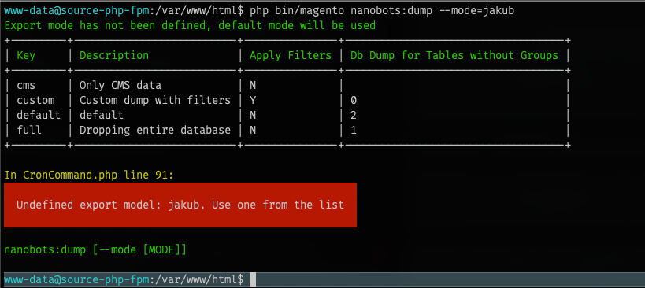

<h1 style="text-align: center;">Nanobots DbDumper </h1>

This module was designed simply to create advanced database dumps for Magento 2 Open Source Projects.
It does work on Adobe Cloud and Adobe Commerce, but you need to download files manually (this
might be changed in the future releases of this module)

## Ok, But why?

It is very simple! Because we can! But in all seriousness, Magento 2 has been on Market
a long time and nobody has created a module that out of the box has the following features:

* allow to specify SQL filters on any table (for example to limit the product catalog, 2 examples are part of the module)
* customer and user admin accounts data anonymization by default
* junk data is never added to dumps

So, that is why this module was developed.

## Installation

Installation is via `composer`
```
composer require enanobots/m2-nanobots-dbdumper
```

After installing the packages just run:
```
php bin/magento setup:upgrade
```

### Requirements:
* `PHP 7.4` and higher
* `Magento 2.4.x` and higher

### Tested on:
* `Magento 2.4.x` OpenSource

# WIKI

This section will describe how the module is designed. So let me start with:

## Export Modes

This module allows you to create any database export profiles you wish, however I've called them
`Export Models`. The main Export model implements `ExportModelInterface` and all Export Models are defined as `VirtualTypes` so you can
add any custom Export Model you wish.

In this first release of the extension, `Export Model` has 4 params:
* `$exportModeDescription` - visible in CLI if you specify wrong export Model, just a visual note
* `$applyFilters` - determines if a custom filters on tables should be applied
* `$tableGroups` - if you specify this list, you can export only selected tables from the database
* `$exportTypeForAllTables` - determines if data from custom tables should be exported. Yeah... this variable name will probably be changed

An export model is defined in the `di.xml`, this module has 2 additional Export Models:
* `custom` that filters product catalog, more on that lateer
* `cms` - exports only tables from cms table group

You can find this in the `di.xml` file:
```xml
    <virtualType name="customExportMode" type="Nanobots\DbDumper\Model\ExportModel">
        <arguments>
            <argument name="exportModeDescription" xsi:type="string">Custom dump with filters</argument>
            <argument name="applyFilters" xsi:type="boolean">true</argument>
            <argument name="exportTypeForAllTables" xsi:type="number">0</argument> <!-- ask what to do -->
        </arguments>
    </virtualType>

    <virtualType name="cmsExport" type="Nanobots\DbDumper\Model\ExportModel">
    <arguments>
        <argument name="exportModeDescription" xsi:type="string">Only CMS data</argument>
        <argument name="applyFilters" xsi:type="boolean">false</argument>
        <argument name="tableGroups" xsi:type="array">
            <item name="cms" xsi:type="object">cms</item>
        </argument>
    </arguments>
    </virtualType>
```

Those export models need to be added to the `DumpInterface` `exportModels` argument in the `di.xml`
```xml
<type name="Nanobots\DbDumper\Model\DumpInterface">
    <arguments>
        <argument name="exportModels" xsi:type="array">
            <item name="cms" xsi:type="object">cmsExport</item>
            <item name="custom" xsi:type="object">customExportMode</item>
            <item name="default" xsi:type="object">defaultExportMode</item>
            <item name="full" xsi:type="object">fullExportMode</item>
        </argument>
        [...]
    </arguments>
</type>
```

You can define as many export models as you want.

## Table Groups Interface
The main part of this module is based on an assumption that Magento 2 tables can be divided into table groups.
A group of tables is a `VirtualType` that uses a `TableGroup` model, which implements `TableGroupInterface`.
The role of a group is simply to specify a set of actions that can be or should be performed on all tables in the table group so we don't have
set this for every single table defined in the database - although it is possible, it would make the `di.xml`
file too large to maintain.

In this initial version of the module a group can have 3 group modes, defined by `groupExportMode` in `di.xml`:
* `default` - it means that each table from this group is exported with all it's data
* `reduntant` - data from tables in this group will not be exported to database dump file
* `anonymize` - data from these tables needs to be anonymized. By default, it is related to: admin accounts, customers
customer addresses and sales data.

Table Group export mode is overwritten by the `CLI` param set when running the export manually.

### Grouping Tables by `%` character

It is not require to define all database tables, you can specify a `wildcard` with the `%` character and use it like this:
```xml
    <item name="%_idx" xsi:type="null"/>
    <item name="%_log" xsi:type="null"/>
    <item name="%_cl" xsi:type="null"/>
    <item name="%_tmp" xsi:type="null"/>
    <item name="%_replica" xsi:type="null"/>
    <!-- [...] -->
    <item name="sequence_creditmemo_%" xsi:type="null"/>
```
The code will find all matching tables by running proper queries on the database.

## Table Export Interface

This is the main interface that transforms data from the database into
* create table / view statements
* fetches data from the table

and puts it into a database dump file

A default list of `restrictedColumns` is defined in the `di.xml`. If a table needs to be anonymized
(which is defined by a TableGroup the table belongs to) table is checked if any of the columns match the
restricted column list. If a column is found in the restrictedColumn list, value from that table row will be
"faked" or anonymized.

### Example: email anonymization

Email DataFakers (or anonymizer) has 2 additional arguments:
```xml
<type name="Nanobots\DbDumper\Model\DataFakers\Email">
    <arguments>
        <argument name="emailSchema" xsi:type="string"><![CDATA[{{firstname}}.{{lastname}}]]></argument>
        <argument name="emailDomain" xsi:type="string"><![CDATA[nanobots.info]]></argument>
    </arguments>
</type>
```
and has 2 methods:
```php
    public function decorateData(int $entityId, ?string $value = null): string
    {
        return sprintf("%s@%s", $this->_getEmailFromSchema($entityId), $this->emailDomain);
    }

    private function _getEmailFromSchema(int $entityId): string
    {
        return str_replace(
            [
                '{{firstname}}',
                '{{lastname}}'
            ],
            [
                $this->translitUrl->filter($this->firstname->decorateData($entityId)),
                $this->translitUrl->filter($this->lastname->decorateData($entityId))
            ],
            $this->emailSchema
        );
    }
```
if you check the `Firstname` DataFaker class you will see that it is using `modulo` division.
```php
[...]
    return $this->firstNames[$entityId % (count($this->firstNames) - 1)];
[...]
```
It is on purpose, so each time you download the database, you will get matching, but randomized names or email
for the same ID.
When you work with the team and debug some sales / customer data, it is important to identify data not
just by an ID.

## Working in CLI

To start DB dump operation you can simply start the following command in CLI:
```
php bin/magento nanobots:dump --mode=ZZZ
```
This will initiate the `dump` command. For example, let's use an export mode that is not defined:

```
php bin/magento nanobots:dump --mode=jakub
```
you will get the following result:



In the `custom` Export Model, system will ask you what to do with tables that are not defined in a table group:

by typing `0`, `1` or `2` you can
* force db dump to export all data from tables without table groups
* skip the data from additional tables
* quit

### Recommended actions:

It is recommended to create your own module and add tables to a specified group for every project you manage:
* `core` defined as a virtualGroup in the `di.xml` to export all data
* `empty` defined as a virtualGroup in the `di.xml` to only export table structure

#### Example:
`di.xml` in your custom module

```xml
    <virtualType name="core" type="Nanobots\DbDumper\Model\TableGroup">
        <arguments>
            <argument name="tableList" xsi:type="array">
                <item name="my_custom_table_with_required_data" xsi:type="null" />
            </argument>
        </arguments>
    </virtualType>

    <virtualType name="empty" type="Nanobots\DbDumper\Model\TableGroup">
        <arguments>
            <argument name="tableList" xsi:type="array">
                <item name="my_custom_table_with_redundant_data" xsi:type="null" />
            </argument>
        </arguments>
    </virtualType>
```

## Important!
* Final DB Dump is setting indexers into **on save** mode.
* `xsi:type="null` is being used a lot as array keys are our final `tables`
* all `_cl` tables are empty and their autoincrement field is set to 1.
* all `mviews` are set to `idle` state
* SQL triggers are not dropped in the SQL dump, you can recreate them by setting indexers to **On Schedule** mode


### Types of data:

The main Module assumption is that we have 3 sets of data:
* data we would like to anonymize or filter in somehow.
* data that is redundant and is not required in database dumps
* undefined data, which is all the data in the database we don't want to filter or is redundant

Based on those assumptions multiple interfaces were created:
* GroupInterface - used to created VirtualTypes with table groups
* TableExportInterface
* BlaBlaInterface

## Release Notes & Change log

### 1.0.0
- module release, possibly with few bugs :-)

## Plans and next versions of the module:
- 1.1.0: adding product media images to a zipped file after `DBDump` creation
- 1.2.0: adding admin interface to control and download db dumps (they will be secured)
- 1.3.0: extending admin interface and module with DB dump profiles (more on that with the release)
- 1.4.0: extending module with task feature to be able to customize and hook into db dump process even further
